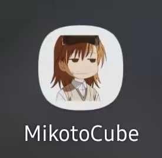
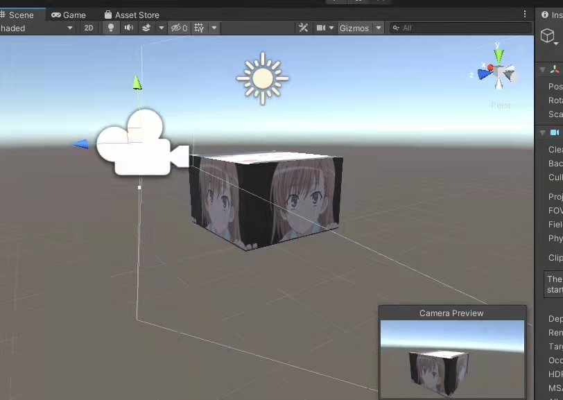

# MisakaMikotoCube_VR
 
 
 

Android VR Game? App? that shows cube of **Misaka Mikoto**s. That's it!

Made with Unity editor 2019.3 and Google Cardboard API, so this would best work with a Cardboard goggle. Took a whole day to make, how efficient!

This is basically all that you'll see!

...That's really it here, this is the first Unity app ever made by myself, so I'm leaving my marks here to celebrate this symbolic moment lel

***btw, Misaka Mikoto best girl <3***

